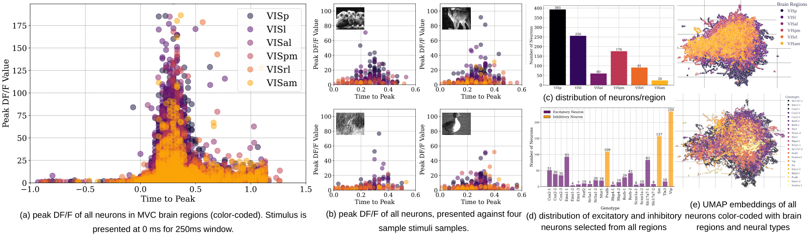
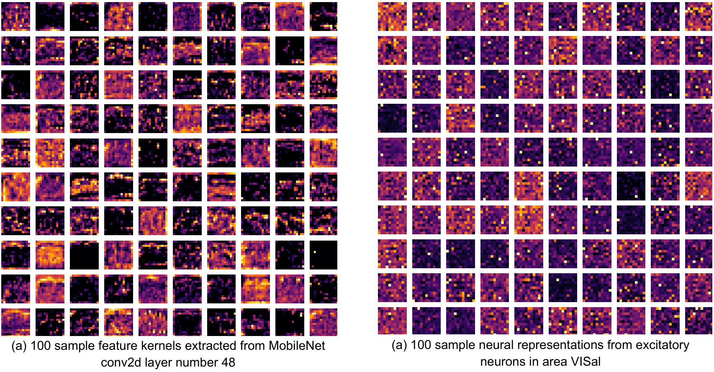
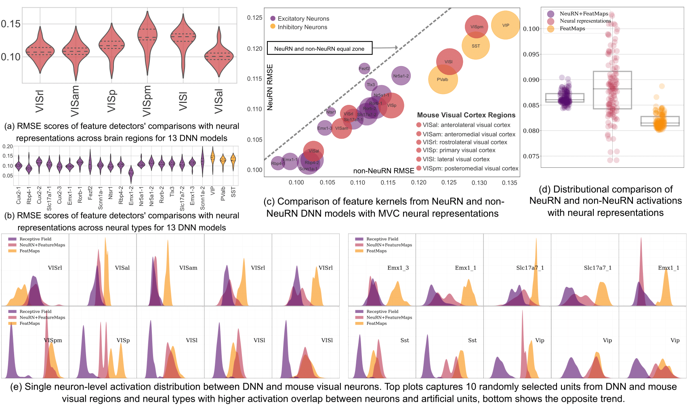
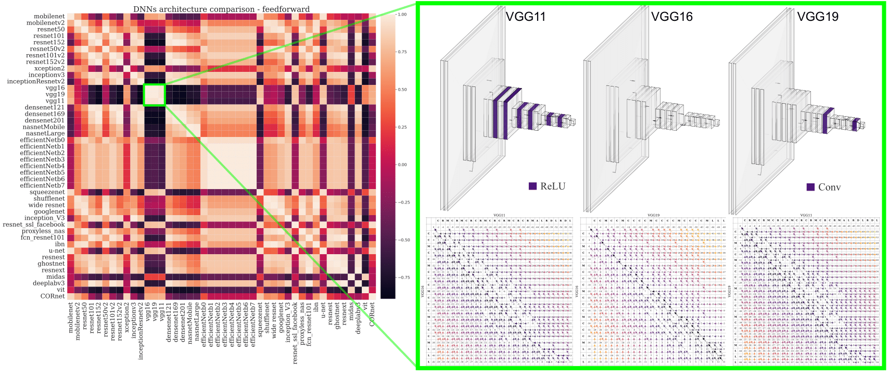
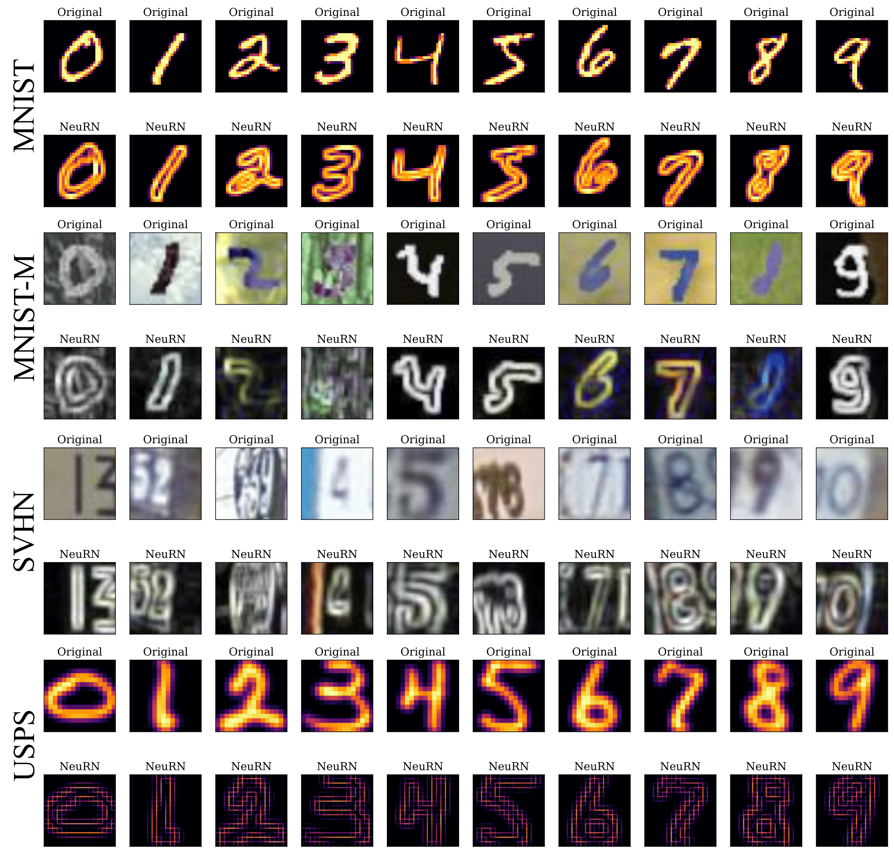

<h2 style="text-align: center;">Introduction</h2>

Domain generalization in image classification is a crucial challenge, with models often failing to generalize well across unseen datasets. We address this issue by introducing a brain-inspired \textbf{Neu}ral \textbf{R}esponse \textbf{N}ormalization (NeuRN) technique that draws inspiration from neurons in the visual cortex, resulting in performance boost on unseen target domains by training deep learning models on a single source domain. Our study involves a comprehensive benchmarking of NeuRN in deep learning architectures for image classification tasks where NeuRN-integrated models outperform their baseline versions. We demonstrate this benchmarking performance on a variety of image classification tasks across a range of deep learning architectures, including the ones derived from Neural Architecture Search (NAS) and Vision Transformers (ViTs). In addition, we also measure the underlying architectural (dis-)similarity across the deep learning architectures that undergo the performance boost by designing a novel Needleman-Wunsch algorithm-based technique. We believe our framework adds to the foundation of Neuro-inspired Artificial General Intelligence (AGI), focusing on maximizing the domain shift robustness in high-performing models, inspired by the biological feature representations.

<!-- 
<h2 style="text-align: center;">Mouse Visual Cortex & Deep Learning Neural Networks</h2>

Block diagram architecture of comparison framework: Image stimuli is presented to mice and DNN models (Step 1) and their corresponding feature (Step 2) and neural representations (Step 3) are computed and compared (Step 4).

<h2 style="text-align: center;">Allen Brain Observatory Data</h2>

Mouse Visual Cortex (MVC) data statistics: The peak activation profiles of all neurons are presented as well as their cluster profiling and distribution based on neural genotypes and brain regions.

<h2 style="text-align: center">Neural and Feature Representations</h2>

Representational similartiy between feature representations in a sample DNN model and MVC neural representations

<h2 style="text-align: center">Population & Neuron Level Analysis</h2>

(a) RMSE scores of comparing feature representations with neural representations across MVC brain regions for all the shortlisted DNN architectures, (b) shows the similar focused across neural sub-types: excitatory and inhibitory neural genotypes. The comparison between NeuRN and non-NeuRN architectures are shown in (c) with diagonal line defining the winning models for their neural compatibility. In (d), comparison of neural representations and DNN activations is mapped for both NeuRN and non-NeuRN DNN architectures, showing the activation curves of randomly sampled units in (e).

<h2 style="text-align: center">Summary</h2>

In this study, we explore the fascinating interplay between artificial and biological neural networks. Our work reveals a striking similarity between these systems, particularly with excitatory genotypes. To further investigate, we developed NeuRN, a neuro-inspired layer for Deep Neural Networks (DNNs), which enhances the resemblance between artificial feature and biological neual representations. Our detailed analyses at both population and single neuron levels confirmed the increased similarity and biological plausibility brought about by NeuRN. This novel layer not only boosts the generalizability and robustness of DNNs but also significantly improves performance on domain adaptation tasks, as evidenced by our experiments with Neural Architecture Search (NAS) and various DNNs. In essence, our findings underscore the potential of biological mechanisms to significantly refine and advance artificial neural networks.

-->

<h2 style="text-align: center">DNN Architectural Similarity</h2>

DNNs' architectural similarity: The confusion matrix on the left shows the correlation similarity of 44 DNN architectures with purple as the lowest and skin as the highest correlation. The zoom version of three similar architectures (VGG11, VGG16 and VGG19) are displayed with the highlighted layer difference between VGG16 and VGG11 as ReLU and Conv between VGG16 and VGG19. The bottom matrices show the Needleman-Wunsch algorithm applied on these architectures and how the traceback matrix was used to calculate similarity index.

<h2 style="text-align: center">NeuRN (Neural Response Normalization)</h2>

Comparison of original and NeuRN-enhanced images across four handwritten digit datasets. For each dataset, the top row presents samples from the original dataset, while the bottom row showcases the NeuRN-enhanced versions.

<h2 style="text-align: center">Summary</h2>

Our paper introduces two key contributions: a novel brain-inspired technique for generalized domain generalization called NeuRN, and a unique framework for quantitatively assessing the similarity between different DNN architectures. Extensive experiments demonstrate that NeuRN significantly improves the performance of various models, including CNNs, NAS techniques, and ViTs, highlighting its versatility in enhancing domain generalization across different architectures.

<!--  -->
